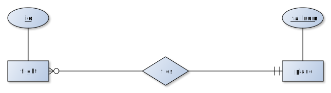

This is a beginner's luck assessment. The goal of the assessment is to assess your knowledge on the topics of this course in order to tune the level of the course and track your progression. The test *is not* meant to give you a judgment or mark. 

Please fill the following information:

Your name: Ginevra Carbone

What you studied before: Mathematics

Your level in the following topics on a scale from 1 (I know nothing) to 5 (I am an expert):

* databases: 1
* programming: 4
* statistics: 3
* linear algebra: 5

# Databases

## Entity-Relationship model

Describe in words the following relationship:

<!--  -->

The image shows flies as a one-to-many relashionship between two entities: flight and plane. This means that one single plane can be associated with more than one instance of flight, but each flight is associated with exactly one instance of plane.
id and tailnum are keys of the instances.

## Relational model
What are key and foreign key constraints of the relational model? Make an example.


## SQL

The nycflights13 contains flight information about flights that left NYC in 2013. In particular, flights table contains data about these flights and planes table contains information about planes used by these flights:

```{r}
library(nycflights13)
flights
planes
```
Write in SQL the following queries

1. the tailnum and the number of engines of planes manufactured by AIRBUS INDUSTRIE sorted by number of engines
2. the number of planes grouped by number of engines
3. the flights that flew with a plane manufactured by BOEING


<pre>
-- the tailnum and the number of engines of planes manufactured by AIRBUS INDUSTRIE sorted by number of engines
SELECT ___, ___
FROM ___
WHERE ___
ORDER BY ___

-- the number of planes grouped by number of engines
SELECT ___, ___
FROM ___
GROUP BY ___

-- the flights that flew with a plane manufactured by BOEING
select ___
from ___, ___
where ___ and ___
</pre>


You can run SQL queries from R as follows (don't bother the code, just use it!)

```{r eval=FALSE}
# load R Database Interface
library(DBI)

# connect to an SQLite database (create one if not existing)
nyc <- dbConnect(RSQLite::SQLite(), dbname = "nycflights13")

# Write dataframes into database tables
dbWriteTable(nyc, "flights", flights)
dbWriteTable(nyc, "planes", planes)

# run query and head the output
df = dbGetQuery(nyc, "select * from planes") 
head(df)

# disconnect
dbDisconnect(nyc)

# remove the database if no more necessary
unlink("nycflights13")
```


# R

## Vectors
Consider the following Boolean vector:

```{r}
x = c(TRUE, FALSE, TRUE, FALSE)
```

* Write a vector y that is the negation (the *not*) of x (that is, it changes TRUE with FALSE and FALSE with TRUE)
* Write a vector z that is the conjunction (the *and*) of x and y
* Write a vector w that is the disjunction (the *or*) of x and y

```{r eval=FALSE}
# negation
y =!x

# conjunction
z = x & y

# disjunction
w = x | y
```

## Lists

* Write a list that contains elements thing with value "hat", size with value 8.25, and female with value "TRUE".
* Select the first element of the list in two different ways
* Select the sublist with the first and last elements of the original list

```{r eval=FALSE}
# create the list
l = list(thing="hat", size="8.25", female="TRUE")

# select the first element (first way)
l$thing

# select the first element (second way)
l[1]

# select the sublist
c(l[1],l[3])

```

## Dataframes

Consider the following vectors:

```{r}
team = c("Inter", "Milan", "Roma", "Palermo")
score = c(59, 58, 53, 46)
win = c(17, 17, 15, 13)
tie = c(8, 7, 8, 7)
lose = c(3, 4, 5, 8)
```

* Create a dataframe with those columns
* output the number of rows and number of columns of the dataframe
* select the first row and the first column of the dataframe

```{r eval=FALSE}
# create a dataframe
df = data.frame(team, score, win, tie, lose)

# number of rows
nrow(df)

# number of columns
ncol(df)

# first row
print(df[1,])

# first columns
print(df[,1])


```

## Functions

* Write a function called Euclide that computes the Euclidean distance from a bi-dimensional point (x,y) and the origin (0,0)
* Compute the distance of point (1,1) from the origin


```{r eval=FALSE}
# write euclidean function
O = c(0,0)
Euclide = dist(rbind(P,O))

# compute the distance of point (1,1)
P = c(1,1)
Euclide

```

# Query with dplyr

Consider again the planes and flights tables of nycflights13 dataset:

```{r}
library(nycflights13)
flights
planes
```

Write in dplyr the following queries:

1. the tailnum and the number of engines of planes manufactured by AIRBUS INDUSTRIE sorted by number of engines
2. the number of planes grouped by number of engines
3. add an id attribute to the flights table with row numbers as values
4. the id, tailnum and manufacturer of flights that flew with a plane manufactured by BOEING

```{r eval=FALSE}
library(dplyr)

# The tailnum and the number of engines of all planes manufactured by AIRBUS INDUSTRIE sorted by number of engines
planes %>%  
  filter() %>%
  arrange(engines) %>%
  select(tailnum, engines)

# The number of planes grouped by number of engines
planes %>%
  group_by(engines) %>%
  summarize(n())

# add id to flights and move it as first column of the table
id = list(rownames(flights))
flights2 = mutate(flights, id) %>% select(id, everything())
flights2

# The flights that flew with a plane manufactured by BOEING.
left_join(___, ___, by = ___) %>%
  select(___, ___, ___) %>%
  filter(___) 

```

# Visualization with ggplot

Consider the following dataset containing information about diamonds:

```{r}
library(ggplot2)
head(diamonds)
```

Use ggplot2 to visualize the following plots:

1. a barplot of variable cut
2. a histogram of variable carat
3. a scatterplot of carat versus price

```{r eval=FALSE}

# a barplot of variable cut
ggplot(diamonds, aes(cut)) + geom_bar()

# a histogram of variable carat
ggplot(diamonds, aes(carat)) + geom_histogram(binwidth = 0.01)

# a scatterplot of carat versus price
ggplot(diamonds, aes(x=carat, y=price)) + geom_point()
```

# Linear models

Consider again the following dataset containing information about diamonds:

```{r}
library(ggplot2)
head(diamonds)
```

1. filter diamonds with carat <= 2.5 and log transform price and carat
2. fit a linear model of (log-transformed) price in terms of carat
3. show model statistics and try to interpret them
4. compute Pearson correlation between price and carat
5. scatterplot price and carat using hexagonal heatmap and add interpolation line

```{r eval=FALSE}
# filter diamonds and log transform price and carat
diamonds2 = diamonds %>% 
  filter(carat<=2.5) %>% 
  mutate(lprice = log(price), lcarat = log(carat))

# linear model of price in terms of carat
mod = lm(price ~ carat, data = diamonds2)

# model statistics
summary(mod)

# Pearson correlation
cor(diamonds$price, diamonds$carat, method="pearson")

# scatter plot using hexagonal heatmap with interpolation line
ggplot(diamonds2, aes(x = price, y = carat)) +
  geom_point() + 
  geom_smooth(method="lm")

```

# Networks

1. Briefly describe the node centrality measure known as PageRank on networks
2. What is a scale-free network?
3. What is a small-world network?

# XML 

1. Write an XML document containing the following information: Alan Turing was born on 23/06/1912 and died on 07/06/1954. He had three professions: computer scientist, mathematician, and cryptographer.
2. Write in XPath a query on the previous XML document that retrieves all the professions of Alan Turing 

You can run XPath queries in R as follows:

```{r eval=FALSE}
# load XML library
library(xml2)

# read XML file from a string
x = read_xml("<a><b/><b/><c/></a>")

# run XPath
xml_find_all(x, xpath = "/a/b")

```

# Text mining

1. Describe the measure tf-idf
2. What is an n-gram?
an n-gram is a sequence of words in a text
3. What is sentiment analysis?
sentiment analysis is a binary classification method in classes "positive" and "negative"


